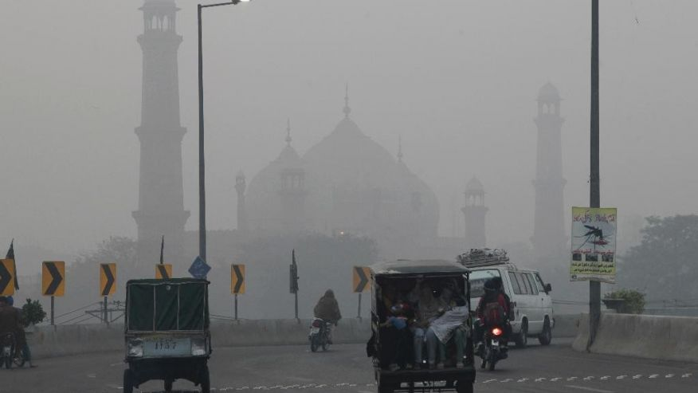

Air Quality Explorer
========================================================
author: Aaron Taylor
date: September 27, 2017
autosize: true

***


The Air Quality Explorer
========================================================

A simple Shiny App that lets you compare the different data of the airquality dataset. It can:

- Choose an arbitrary sample size (up to the size of the data)
- Compare any variables on the x- or y-axis
- Adjust the color by any variable
- Adjust the size by any variable
- Create a linear regression line
- create a smooth line, with 95% confidence interval
- Split the plot by rows according to a given variable
- Split the plot by columns according to a given variable

All of which lets you perform visual data analysis on airquality to your heart's content.
https://github.com/amontgom/DevelopingDataProducts_FinalProject

<div align="center">

</div>


The airquality dataset -- description
========================================================

New York Air Quality Measurements

Description

Daily air quality measurements in New York, May to September 1973.

Usage

airquality

Format

A data frame with 154 observations on 6 variables.

1.	Ozone	 numeric	 Ozone (ppb)
2.	Solar.R	 numeric	 Solar R (lang)
3.	Wind	 numeric	 Wind (mph)
4.	Temp	 numeric	 Temperature (degrees F)
5.	Month	 numeric	 Month (1--12)
6.	Day	 numeric	 Day of month (1--31)


The airquality dataset -- description, cont.
========================================================
Details

Daily readings of the following air quality values for May 1, 1973 (a Tuesday) to September 30, 1973.

- Ozone: Mean ozone in parts per billion from 1300 to 1500 hours at Roosevelt Island

- Solar.R: Solar radiation in Langleys in the frequency band 4000-7700 Angstroms from 0800 to 1200 hours at Central Park

- Wind: Average wind speed in miles per hour at 0700 and 1000 hours at LaGuardia Airport

- Temp: Maximum daily temperature in degrees Fahrenheit at La Guardia Airport.

Source

The data were obtained from the New York State Department of Conservation (ozone data) and the National Weather Service (meteorological data).

References

Chambers, J. M., Cleveland, W. S., Kleiner, B. and Tukey, P. A. (1983) Graphical Methods for Data Analysis. Belmont, CA: Wadsworth.


The airquality dataset -- structure
========================================================


```r
dim(airquality)
```

```
[1] 153   6
```

```r
str(airquality)
```

```
'data.frame':	153 obs. of  6 variables:
 $ Ozone  : int  41 36 12 18 NA 28 23 19 8 NA ...
 $ Solar.R: int  190 118 149 313 NA NA 299 99 19 194 ...
 $ Wind   : num  7.4 8 12.6 11.5 14.3 14.9 8.6 13.8 20.1 8.6 ...
 $ Temp   : int  67 72 74 62 56 66 65 59 61 69 ...
 $ Month  : int  5 5 5 5 5 5 5 5 5 5 ...
 $ Day    : int  1 2 3 4 5 6 7 8 9 10 ...
```

```r
head(airquality)
```

```
  Ozone Solar.R Wind Temp Month Day
1    41     190  7.4   67     5   1
2    36     118  8.0   72     5   2
3    12     149 12.6   74     5   3
4    18     313 11.5   62     5   4
5    NA      NA 14.3   56     5   5
6    28      NA 14.9   66     5   6
```
